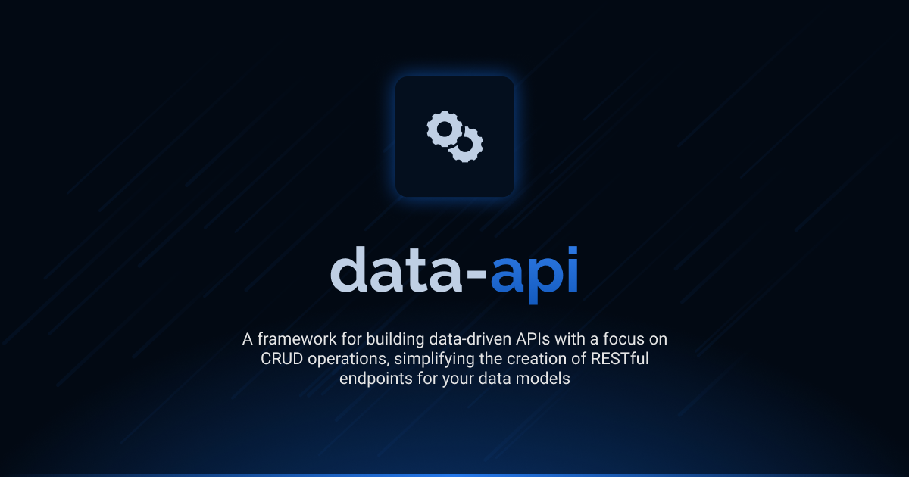

# Interface Data API

[](LICENSE.md)
[](https://github.com/antelopejs/antelope)

A robust framework for building data-driven APIs with a focus on CRUD operations. Interface Data API extends the core API interface with specialized functionality for handling database records, making it simple to create RESTful endpoints for your data models.

## Installation

```bash
ajs module imports add data-api@beta
```

## Documentation

Detailed documentation is available in the `docs` directory:

- [Introduction](./docs/1.introduction.md) - Overview and basic concepts
- [Data Controllers](./docs/2.data-controllers.md) - Creating and using Data API controllers
- [Data Metadata](./docs/3.data-metadata.md) - Decorators for configuring data fields
- [Query Operations](./docs/4.query-operations.md) - Documentation on data querying capabilities
- [Parameter Handling](./docs/5.parameter-handling.md) - Details on parameter processing for data endpoints

## Current Status

This is the beta version of the Interface Data API. It is currently in pre-release stage and may undergo changes before the final release. The interface is not considered stable for production use without understanding that breaking changes may occur.

## License

This project is licensed under the Apache License 2.0 - see the [LICENSE.md](LICENSE.md) file for details.
